# TriageIQ

**Which customer complaints will end up costing a company money?**

TriageIQ reads a new complaint, checks the company's track record, and estimates the chance that the
complaint ends with the company paying the customer. Risky complaints go to a senior analyst; the
rest get a standard reply.

> [!NOTE]
> **Work in progress.** Numbers marked **⏳** don't exist yet. They get filled in as each step finishes.

---

## At a glance

| | |
|---|---|
| 📨 **4.8 million** | real consumer complaints (2022–2024) |
| 🏢 **4,946** | companies complained about |
| 📅 **~4,400** | new complaints a day, across all companies |
| 💸 **1 in 80** | complaints end with the company paying money |
| 📝 **1 in 3** | complaints include the customer's own written story |
| 🎯 **80 / 100** | a simple starting model, on the most realistic test |
| 🤖 **⏳ / 100** | the fine-tuned AI model, on the same test |
| 💰 **$0** | budget — a student laptop and free cloud tools |

---

## 1. The problem

In the US, anyone with a problem with a bank, lender or credit bureau can file a complaint with the
**Consumer Financial Protection Bureau (CFPB)**, a government agency. The CFPB sends it to the
company, which is expected to respond within **15 days**, and publishes the complaint in a public
database.

Every complaint is closed in one of a few ways. The one that matters most to the company is
**"Closed with monetary relief"** — the company paid money back: a refund, a reversed fee,
compensation.

So for every new complaint, a complaints team has to decide who handles it:

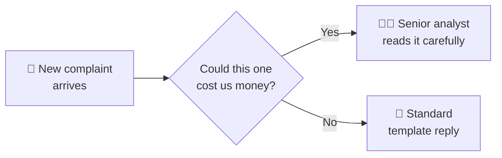

**TriageIQ answers the question in the middle.**

### Why that's hard

**1. It's a needle in a haystack.** Only about 1 in 80 complaints ends with a payout.

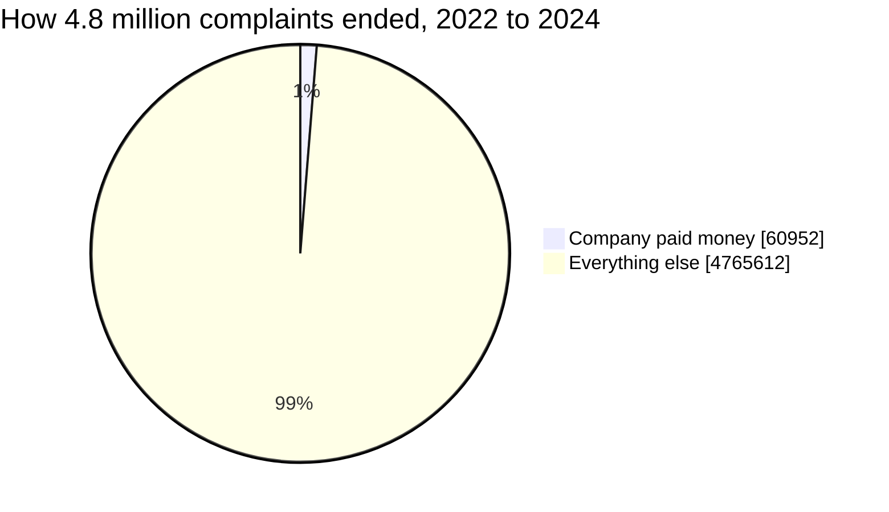

**2. The money is not where the complaints are.** Credit-report complaints are **83%** of everything
but only **3%** of the payouts. Credit cards and bank accounts are just **6%** of complaints but
**76%** of the payouts.

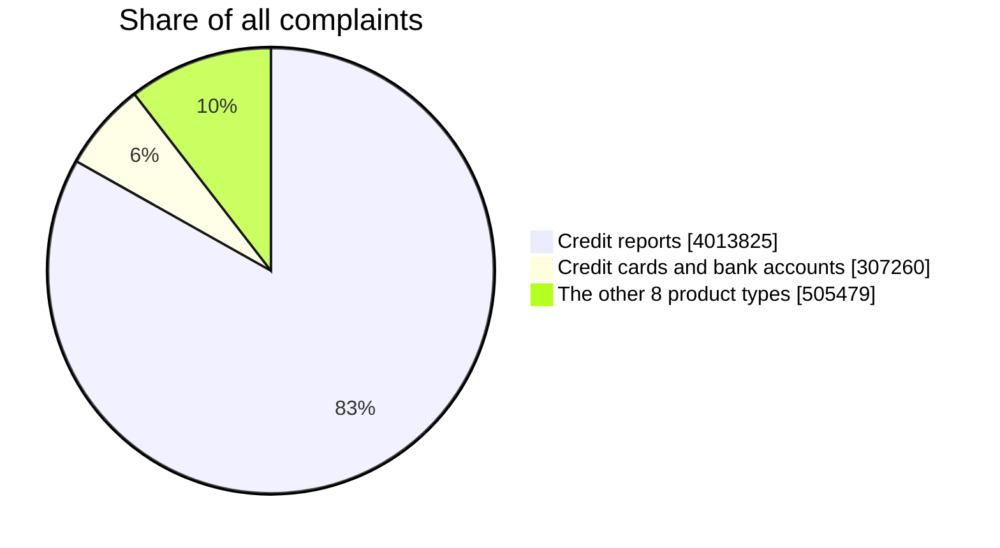

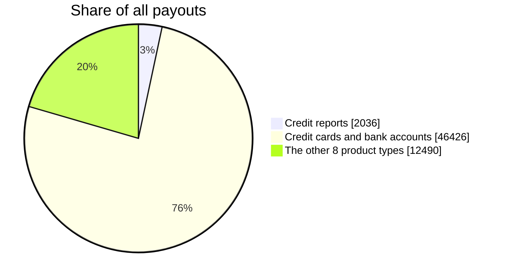

**3. Simple rules miss the expensive surprises.** "Send every credit-card complaint to a senior"
sounds sensible, but only about 1 in 7 of those pay out, so most of that senior time is wasted.
And rules ignore rare cases elsewhere. Picture a student-loan complaint about a $200,000 loan that
was never paid out: student-loan complaints pay out only about 1 in 90 times, so a product rule
would send it a template. Only reading the actual words catches it.

---

## 2. The idea — two readers, one score

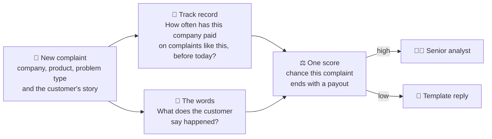

- **🧮 The track record** is built from all 4.8 million complaints in a database. For every company it
  works out, day by day, how often that company paid out on each kind of problem.
- **📝 The words** are read by an AI language model (DistilBERT, a smaller, faster version of Google's
  BERT), trained on how past complaints actually ended.
- **⚖️ One score** combines both. Neither is enough on its own — see the results below.

**What a complaints team gets back for each complaint:**

| | |
|---|---|
| Chance this complaint ends with a payout | ⏳ % |
| Suggested route | 👩‍💼 senior analyst, or 📄 template reply |
| The 5 most similar past complaints | ⏳ of 5 ended with a payout |

---

## 3. Playing fair — no peeking at the future

A model can look brilliant in testing if it accidentally sees the future — like a student who had the
answer key. TriageIQ follows one strict rule: **to score a complaint, use only what was known on the
day it arrived.**

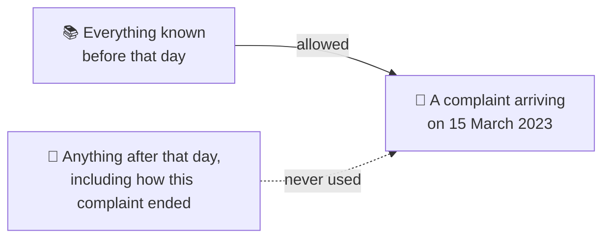

Two details make this harder than it sounds:

- **Companies take time to answer.** So the track record only counts complaints at least 60 days old —
  outcomes that would really be known by then.
- **Many complaints share a date.** On 43% of the days a company received complaints, it received more
  than one — once, 4,245 in a single day. "Before this complaint" needs a careful rule, or a
  complaint's own outcome leaks into its own score.

The model is also tested the way it will be used: **on complaints that come after the ones it learned
from.**

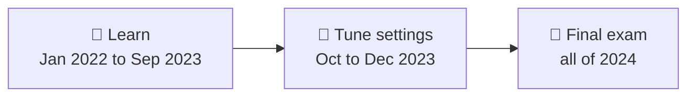

That matters, because payouts are getting rarer — among complaints with a written story, **2.7%** paid
out in 2022 but only **1.7%** in 2024. The final exam is harder than the lessons.

---

## 4. The data

**100% real and public:** the CFPB Consumer Complaint Database. Nothing is invented.

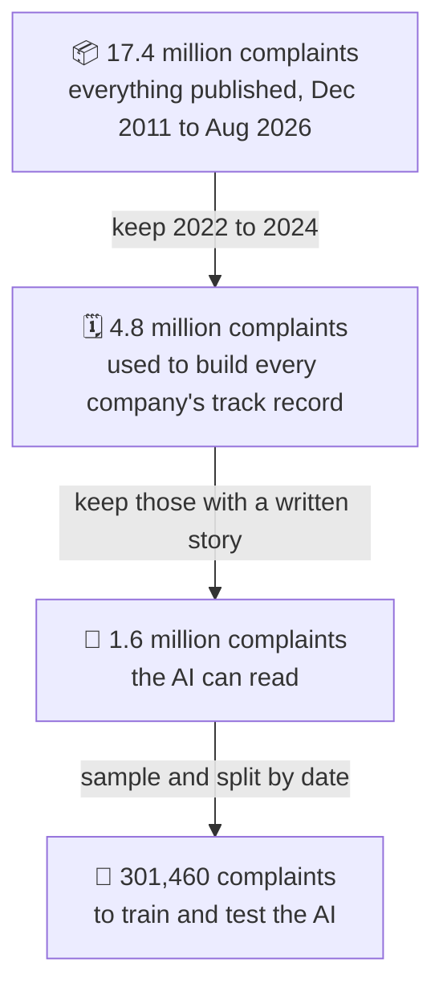

**Why keep the 3.2 million complaints that have no written story?** The AI can't read them, but they
hold **42% of all payouts**. Without them, every company's track record would be wrong — by a
different amount for each company.

**The categories changed halfway through.** In August 2023 the CFPB renamed and split some product
categories. Loaded as-is, a company's history would reset to zero overnight. A translation table fixes
this: 14 names become 11 consistent categories, and **1.3 million complaints** are re-labelled so their
history carries over. The same day, one of the most common *problem types* was renamed too — another
337,252 complaints re-labelled the same way. One product example:

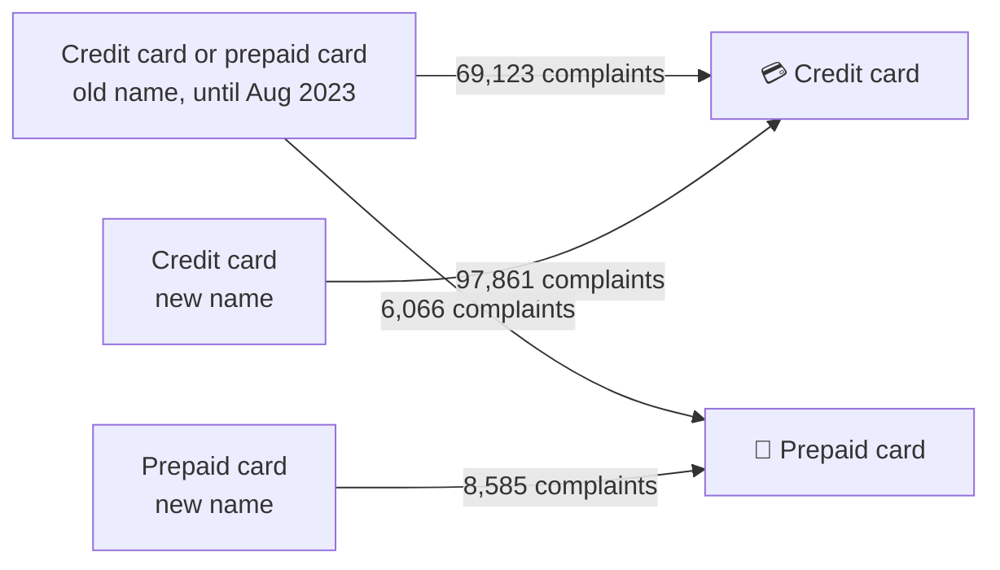

---

## 5. Results so far

The AI model isn't trained yet. These scores come from a **simple starting model** (word counts plus
track record) — the bar the AI has to beat. It was tested on **150,000 complaints from 2024** that it
never saw while learning.

**How to read the score:** take one complaint that ended with a payout and one that didn't. How often
does the model rank the payout one higher? **50 = a coin flip, 100 = perfect.**

We test it three ways, from easiest to most realistic:

```
Coin flip (no skill at all)            ██████████            50
Easy test      any two complaints      ███████████████████▎  96
Fair test      same product + problem  ██████████████████▋   93
Real-life test same company only       ████████████████▏     80
```

> [!IMPORTANT]
> **We treat the lowest number as the honest one.** A model earns easy points just by knowing that
> credit-card complaints pay out more often than credit-report complaints. That's true, but useless to a
> bank sorting its *own* complaints. The real-life test takes those easy points away.

**Words vs track record — which matters more?**

| test | 📝 words only | 🧮 track record only | ⚖️ both |
|---|:---:|:---:|:---:|
| Fair test (same product + problem) | 89 | 91 | **93** |
| Real-life test (same company only) | 79 | 75 | **80** |

Inside one company — the situation a real complaints team is in — **what the customer wrote matters
more than the history.** Together they do best.

**Still to come:**

| | simple starting model | AI + track record |
|---|:---:|:---:|
| Real-life test score | 80 | ⏳ |
| Fair test score | 93 | ⏳ |
| Share of payouts caught if seniors read only the riskiest 10% | ⏳ | ⏳ |
| Time to score one complaint | — | ⏳ |

---

## 6. What changes for a complaints team

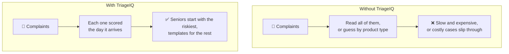

- **Senior time goes where money is at stake:** reading the riskiest ⏳% of complaints catches ⏳% of
  all payouts.
- **Fewer surprises:** rare but expensive cases inside "low-risk" products get flagged by their words.
- **Each score comes with examples:** the most similar past complaints and how they ended (⏳).

---

## 7. Where the project is

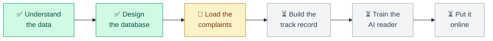

| step | status | what it produces |
|---|---|---|
| Understand the data | ✅ done | proof the complaints were written by real people; the training set |
| Design the database | ✅ done | 10 linked tables, with rules the database enforces itself |
| Load the complaints | 🔄 in progress | reference tables loaded; the 4.8 million complaints go in next |
| Build the track record | ⏳ | each company's history, as of every complaint's date |
| Train the AI reader | ⏳ | the fine-tuned model, and the ⏳ scores above |
| Put it online | ⏳ | a live link anyone can try: ⏳ |

---

## 8. Honest limits

- **It predicts cost to the company, not harm to the customer.** The CFPB publishes no "how badly was
  this person hurt" label, so that can't be tested.
- **It knows *whether* money was paid, not *how much*.** Amounts aren't published.
- **The AI can only read about 1 in 3 complaints** — the ones whose writers chose to publish their story.
- **It decides who looks first, not how a complaint is resolved.** People still handle every complaint.

---

<details>
<summary><b>🛠️ For the technically curious</b></summary>

### How it's built

| part | tool | status |
|---|---|---|
| Database | PostgreSQL 16 + pgvector, in Docker Compose (port 5433) | ✅ running |
| Track record | SQL window functions — point-in-time, as-of each complaint's date | ⏳ Phase 1 |
| Text model | DistilBERT fine-tuned on Kaggle's free T4 GPU | ⏳ Phase 2 |
| Fusion | text model + SQL features combined | ⏳ Phase 2 |
| Serving | FastAPI on Google Cloud Run | ⏳ Phase 3 |

**Design rules:** no leakage (every feature computable at complaint receipt) · one source of truth for
features (training and serving read the same SQL view) · temporal split, never random · case-control
sampling on the train split only, then recalibration (logit offset −2.2572) · reproducible (SEED = 42).

### Baseline numbers in full

TF-IDF + logistic regression, test split: 150,000 complaints from 2024, 2.78% positive.

| model | pooled ROC-AUC | pooled PR-AUC | within product × issue | within company |
|---|---|---|---|---|
| text only | 0.9542 | 0.3551 | 0.8905 | 0.7900 |
| metadata only | 0.9533 | 0.3414 | 0.9076 | 0.7463 |
| **fusion** | **0.9634** | **0.4073** | **0.9330** | **0.8034** |

Reproduce with `python training/verify_ablation.py`. Every number in the project lives in
[`Context/FACTS.md`](Context/FACTS.md).

### What's in this repo

| path | what's inside |
|---|---|
| [`sql/`](sql/) | the database pipeline, run in number order — every folder has a `log.md` |
| [`Context/`](Context/) | design docs: full spec, numbers, database decisions, blog notes |
| [`Data/`](Data/) | data exploration notebook and data profile (the raw CSV is not in git) |
| [`training/`](training/) | scripts that reproduce every quoted number |
| [`Learning/`](Learning/) | study notes |
| [`docker-compose.yml`](docker-compose.yml) | the database container |

### Run it yourself

1. Install Docker Desktop.
2. Download the complaints CSV from the
   [CFPB Consumer Complaint Database](https://www.consumerfinance.gov/data-research/consumer-complaints/)
   and save it as `Data/complaints.csv` (about 9 GB).
3. Copy `.env.example` to `.env` and set `POSTGRES_PASSWORD`.
4. `docker compose up -d` — Postgres starts on `localhost:5433`.
5. Run the SQL files marked ✅ in each folder's `log.md`, in number order: `sql/00_staging/` →
   `sql/01_schema/` → `sql/02_load/`. Use pgAdmin's Query Tool, or:
   ```bash
   docker exec -i triageiq-postgres psql -U triageiq -d triageiq < sql/00_staging/01_load_raw.sql
   ```
   Each file ends with checks and the numbers to expect.

### Go deeper

| read | for |
|---|---|
| [`Context/WHAT_WHY.md`](Context/WHAT_WHY.md) | the pitch — what and why |
| [`Context/TriageIQ.md`](Context/TriageIQ.md) | the full engineering spec |
| [`Context/schema_explanation.md`](Context/schema_explanation.md) | every database decision, and why |
| [`Context/blog_log.md`](Context/blog_log.md) | discarded ideas, surprises, lessons |

</details>
